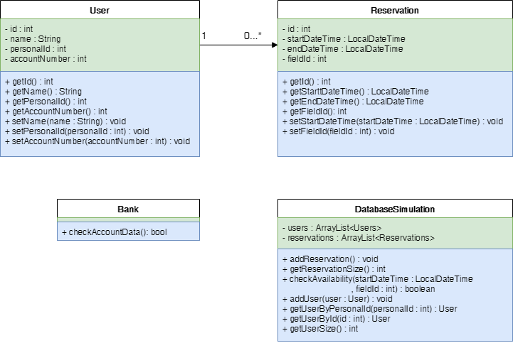

## Ejercicio Reservas

### Estudiantes:
- Te Chen Huang
- Pablo Josue Peraza
- Jose Alejandro Duran
- Maria Jose Barquero Perez
- Johan Echeverría
- Alejandro Rojas

### Descripción de Caso de Uso 

### Diagrama de Caso de Uso

### Diagrama de Clases

