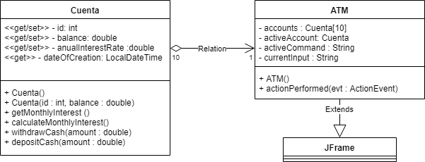

# POO_Lab1
Curso POO  - Lab 1  
Enunciado

## Clase Cuenta:
```
    a. Atributo privado de tipo entero llamado id (valor por defecto 0).  
    b. Atributo privado de tipo double llamado balance (valor por defecto 0).  
    c. Atributo privado de tipo double llamado tasaDeInteresAnual (valor por defecto 0). Note que las tasas de interés son porcentuales. Asuma que todas las cuentas tienen la misma tasa de interés.  
    d. Atributo privado de tipo Date llamado fechaDeCreacion que almacena la fecha cuando se crea la cuenta.  
    e. Un constructor sin argumentos que crea la cuenta por defecto.  
    f. Un constructor que toma los argumentos de id y un balance para crear una cuenta con ellos.   
    g. Los métodos get y set (accessor y mutator) para id, balance y tasaDeInteresAnual.  
    h. El método get para acceder a la fechaDeCreacion.  
    i. Un método llamado obtenerTasaDeInteresMensual() que retorne el interés mensual.  
    j. Un método llamado calcularInteresMensual() que retorne el interés mensual, calculado con la fórmula: balance * tasaDeInteresAnual.  
    k. Un método llamado retirarDinero() que disminuye una cantidad específica de dinero de la cuenta.   
    l. Un método llamado depositarDinero() que aumenta una cantidad específica de dinero a la cuenta.  
```

## Clase Main
```
  a. Cree un objeto de tipo Cuenta, con el id 1122 y un balance de 500.000CRC y un interés anual de 4.5%.  
  b. Utilice el método depositarDinero para sumar 150.000CRC al balance de la cuenta.  
  c. Utilice el método retirarDinero para restar 200.000CRC al balance de la cuenta.  
  d. Imprima en consola el balance, el interés mensual y la fecha de cuando se creó la cuenta.  
  e. Cree un segundo objeto de tipo cuenta con los datos de su preferencia.  
  f. Imprima en consola el balance, el interés mensual y la fecha de creación de la  segunda cuenta.  
  ```


## Clase ATM (Creada con UI)
```
  a. Cree diez cuentas en un arreglo con los id 0, 1, ……, 9 y el balance inicial de 100.000CRC.  
  b. A través de la consola el programa le solicita al usuario ingresar un id, si el id es incorrecto, se le solicita al usuario ingresar nuevamente el id.  
  c. Una vez el id es aceptado, el menú principal se despliega como en el ejemplo  de corrida.  
   Se puede ingresar la opción 1 para ver el balance actual, la 2 para retirar dinero, la 3 para depositar dinero y la 4 para salir del menú.  
   Una vez se haya salido, el programa le solicita al usuario nuevamente ingresar un id, es decir que una vez que se inicie el programa no se detiene su ejecución por si sola.  
```
## Diagrama de Clases

