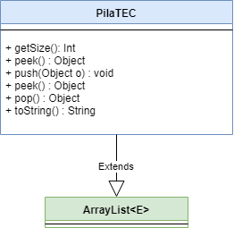

# POO_Lab3
Curso POO  - Lab 3 
Enunciado

## Clase PilaTEC:
```
1. Defina una nueva clase de PilaTEC que extienda a ArrayList y dibuje el diagrama UML para las clases.  
2. Implemente la solución en código.   
3. Escriba además un programa de prueba que le solicite al usuario 5 enteros y después los muestre del último al primero. 
```

## Diagrama de Clases

